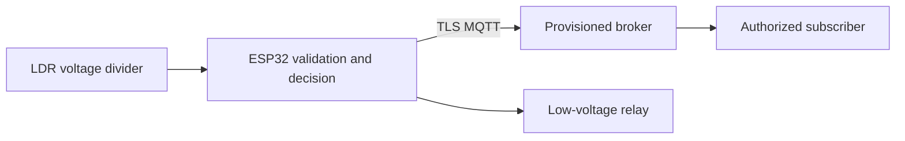

# SmartHomeLightingSystem

## Overview
Smart home lighting is a standalone ESP32 demonstration for home automation learners. It measures light level (ADC counts) and motion (boolean) with LDR voltage divider; PIR motion sensor; opto-isolated low-voltage relay. **Safety:** Relay drives only an isolated low-voltage lamp; ambient threshold requires calibration.

## Problem statement and objectives
Manual checks can miss changes in light level. The objective is to sample the attached hardware every five seconds, validate readings, publish them securely, and flag the project-specific condition `light level < 1200 && motion > 0.5f`. It is an educational prototype, not a certified control or safety product.

## Key features and target users
- Project-specific acquisition and threshold logic for home automation learners.
- Wi-Fi connection and MQTT over TLS with a broker CA certificate and per-device credentials.
- Bounded reconnect backoff, invalid-sample reporting, and low-voltage output fail-safe.
- A native simulation test for the threshold and invalid-reading rule.

## System architecture and data flow

The sensor feeds the ESP32. A validated sample produces an alert flag and a JSON telemetry message under the device's topic. The broker and any subscriber are operator supplied; this repository contains firmware only.

## Hardware components and wiring overview
Use an ESP32 DevKit, LDR voltage divider; PIR motion sensor; opto-isolated low-voltage relay. See [HARDWARE.md](docs/HARDWARE.md) for the pin table, voltage limits, and calibration notes. GPIO14 drives relay only while the reading is valid, the TLS MQTT session is connected, and the alert condition is true.

## Software technologies
PlatformIO, Arduino ESP32, C++, PubSubClient 2.8, and native C++ simulation tests. No backend, database, or frontend is included because this device publishes to an existing broker. There is no bundled dashboard; an authorized MQTT client can consume telemetry.

## Requirements
Functional: sample light level, reject values outside 0–4095 ADC counts, flag `light level < 1200 && motion > 0.5f`, and publish a telemetry record. Non-functional: use a broker-verified TLS connection, unique device credentials, bounded messages, and safe output behavior during a disconnect. Physical measurement accuracy depends on calibration.

## Directory structure
`src/main.cpp` reads the sensor and publishes telemetry; `include/logic.h` contains validation and decision rules; `include/device_config.example.h` is a non-secret template; `test/logic.cpp` simulates edge cases; `docs/` holds implementation-specific guidance.

## Installation, configuration, and device provisioning
Follow [INSTALLATION.md](docs/INSTALLATION.md). Copy the example device configuration to ignored `include/device_config.h`, set Wi-Fi and broker values, paste the broker's CA certificate, and issue a unique MQTT username/password with publish-only ACL for `devices/<device-id>/telemetry`. Build with `python -m platformio run`; flash only after checking the wiring.

## How it works, API, and MQTT communication
Every five seconds firmware reads light level, validates it, computes the alert flag, and publishes the JSON schema in [API.md](docs/API.md). No REST API or inbound command topic is implemented. No measurements are persisted by this repository; see [DATABASE.md](docs/DATABASE.md).

## Security, testing, and troubleshooting
See [SECURITY.md](SECURITY.md), [TESTING.md](docs/TESTING.md), and [TROUBLESHOOTING.md](docs/TROUBLESHOOTING.md). The software build and simulation can run without hardware. Physical sensor accuracy, electrical installation, and end-to-end broker connectivity require user validation.

## Limitations and future improvements
Relay drives only an isolated low-voltage lamp; ambient threshold requires calibration. See [ROADMAP.md](docs/ROADMAP.md) for calibration and field-test work.

## References and license
- [ESP32 Arduino documentation](https://docs.espressif.com/projects/arduino-esp32/en/latest/)
- [PlatformIO ESP32 platform documentation](https://docs.platformio.org/en/latest/platforms/espressif32.html)
- [PubSubClient library](https://github.com/knolleary/pubsubclient)
- [MIT license](LICENSE)
