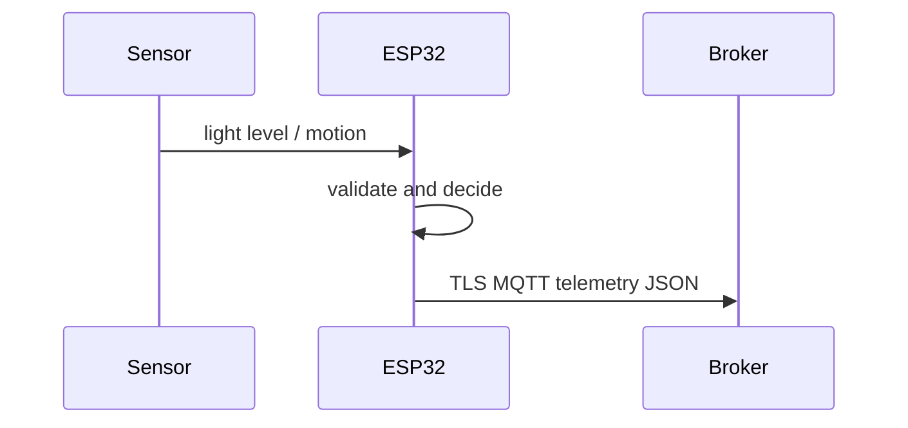

# Architecture — SmartHomeLightingSystem

The analog_digital acquisition path yields a `Sample` of light level and motion. `logic.h` validates the primary value against 0–4095 ADC counts and evaluates `s.value < 1200 && s.aux > 0.5f` only for valid samples. GPIO14 drives relay only while the reading is valid, the TLS MQTT session is connected, and the alert condition is true.

Wi-Fi and broker reconnection use a backoff from one to sixty seconds. The firmware has no inbound command handler. MQTT broker provisioning, persistence, alert delivery, and visualization are outside the codebase. SNTP supplies wall time before TLS certificate validation.
